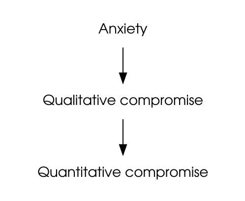

## Outline

```{r, echo=FALSE, results='hide', warning=FALSE, message=FALSE}
prodigenr::runSetup('src')
font_import()
loadfonts()
```

<!--
## Outline

- What is food insecurity
    - Household/person level 'stages' of entering food insecurity
    - Hunger vs food insecurity
    - How food insecurity is measured
    - Limitations to measuring food insecurity
    - Different categories of food insecure
- Insecurity in Canada
    - Overall
    - By province (%)
    - Nunavut (child survey)
    - By province (#)
    - Composition of households
    - Best predictors
    - Groups most and least at risk (as %)
    - By income
    - Social assistance/seniors
- Strategies used to deal with food insecurity
-->

- What food insecurity is
    - Stages
    - Measured
    - Categories
    - Limitations
- Food insecurity in Canada
    - Overall and by province
    - Composition of households
    - Predictors of food insecurity

## Outline

- **What food insecurity is**
    - **Stages**
    - **Measured**
    - **Categories**
    - **Limitations**
- Food insecurity in Canada
    - Overall and by province
    - Composition of households
    - Predictors of food insecurity

# Household food insecurity: another window into problems of nutrition inequity in Canada

-----

> Food security exists when all people, at all times, have physical and economic
access to sufficient, safe, and nutritious food to meet their dietary needs and
food preferences for an active and healthy life

. . .

- Individual/household level access
- Community/societal/food system level
          
-----

> Household food insecurity:
> 
> - Insecure or inadequate access to food due to financial constraints
> - Often called 'hunger'

<!-- pause here, is hunger different from food insecurity? Why? -->

## Measuring 'hunger' on national surveys:	

**1994:** Has your child ever experienced being hungry because the family has
run out of food or money to buy food?

**1996:** Which of the following best describes the food situation in your
household?

- Always enough food to eat 
- Sometimes not enough food to eat
- Often not enough food to eat

**1998:** In the past 12 months, did you or anyone in your household

- Worry that there would not be enough food to eat because of a lack of money?
- Not eat the quality or variety of foods that you wanted because of a lack of
money?
- Not have enough food to eat because of a lack of money?

## Canadian Community Health Survey (CCHS)

- Conducted annually by Statistics Canada to monitor the health of the
population.
- Surveys a nationally representative sample of approximately 60,000 Canadians,
12 years of age and older
- Omits people living on reserves and in institutions, members of the Armed
Forces, and people who are homeless.

## Conceptualization of household food insecurity underpinning HFSSM module

```{r, eval=FALSE}
grViz("
digraph {
    # add nodes
    node [shape = plaintext
        fontname = 'TeX Gyre Adventor']
    A [label = '@@1']
    QlC [label = '@@2']
    QtC [label = '@@3']

    # add edges
    A -> QlC; QlC -> QtC
}
    
    [1]: 'Anxiety'
    [2]: 'Qualitative compromise'
    [3]: 'Quantitative compromise'
")
```

\centering


<!-- Qualitative food selection -->
<!-- Quantitative in food intake, hunger -->

## Household Food Security Survey Module (HFSSM; on the CCHS since 2004)

18 questions, differentiating adults’ and children’s experiences over last 12
months:

- Worry about not having enough food
- Reliance on low-cost foods
- Not being able to afford balanced meals
- Adults/children skip meals
- Adults/children cut size of meals
- Adults/children not having enough to eat
- Adults/children not eating for whole day

> "Because there wasn't enough money to buy food?"

Note:  Prevalence estimates published by Statistics Canada and Health Canada
only include moderate and severe food insecurity.

## Health Canada’s coding of food insecurity[^hcCoding]

| Category | 10-item adult scale | 8-item child scale |
|:---------|:--------------------|:-------------------|
| Food Secure | 0-1 affirmed | 0-1 affirmed |
| Moderately food insecure | 2-5 affirmed | 2-4 affirmed |
| Severely food insecure | $\geq$ 6 affirmed | $\geq$ 5 affirmed |

Table: Food insecurity $\geq$ 2 affirmed

[^hcCoding]: [Determining Food Security Status, HC website](http://www.hc-sc.gc.ca/fn-an/surveill/nutrition/commun/insecurit/status-situation-eng.php)

## USDA codings of food insecurity definitions[^usCoding]

<!-- we often compare to the US, and in this case we differ slightly. US and Can
use the same method to measure food insecurity (ie the same questionnaire), but
they have a different definition. -->

| Category | 10-item adult scale | 8-item child scale |
|:---------|:--------------------|:-------------------|
| Food Secure | 0-2 affirmed | 0-1 affirmed |
| Low food security | 3-5 affirmed | 2-4 affirmed |
| Very low food security | $\geq$ 6 affirmed | $\geq$ 5 affirmed |

Table: Food insecurity $\geq$ 3 affirmed

<!-- While the US has language that includes marginal food insecurity, their 
methods haven't changed and they still use these categories -->

[^usCoding]: [Food Security, USDA](http://www.ers.usda.gov/topics/food-nutrition-assistance/food-security-in-the-us/definitions-of-food-security.aspx)

## Levels of food insecurity[^proof2013]

<!-- Health canada doesn't use the marginal category -->


[^proof2013]: [Taken from the PROOF 2013 report](http://nutritionalsciences.lamp.utoronto.ca/resources/proof-annual-reports/)

## Why is marginal food insecurity it's own level?

Why is it distinct and not grouped with 'food secure'?

. . .

<!-- Thoughts? do you think it's reasonable to include this level? -->

- Marginally food insecure households report conditions of reduced food access and
anxiety about the availability of food.
- Compared to food secure, they are more likely to show other indications of
material hardship.
- e.g., Marginally food-insecure families were more likely to have borrowed money
for rent; delayed bill payments and cancelled telephone, TV or internet services
as a way to free up money for food.  (Loopstra & Tarasuk, Journal of Hunger and
Environmental Nutrition, 2013)
- Research in Canada and the US suggests that a 3-category definition is most
appropriate because there are meaningful distinctions among marginal, moderate,
and severe food insecurity.   (Coleman-Jensen, Social Indicators Research 2010)

## Compared to scales of other countries[^otherCountries]

Comparing the experience of household food insecurity as captured across 22
scales and related ethnographies from 15 different countries:

Commonalities:  

- Uncertainty and worry about food
- Inadequate food quality
- Insufficient food quantity

Consequences (vs core elements) of the experience:

- Hunger and other physiological consequences: present on most scales
- Alienation[^alien]: absent 

Not on scales but recognized in ethnographic work:

- Social unacceptability

[^otherCountries]: Coates et al, J Nutr, 2006
[^alien]: Hamelin et al, 2002

<!-- you've probably already started to notice the difficulties in measuring
food insecurity, and what exactly that entails -->
				
## Limitations: HFSSM inconsistently conducted

Food security module is not always part of the common content, and on years when
it has been optional, some provinces and territories have opted out.

. . .

<!-- Question: outside of the questions themselves, how accurate do you think
the HFSSM is at determining food insecurity> -->

CCHS must underestimate the true prevalence of food insecurity in Canada because
this survey does not include people living on reserves, homeless people, and
residents in some remote locations.

## Limitations: Difficult/impossible to compare across years

| Survey | Measure | Prevalence |
|:-------|:--------|:----------:|
| 1994 NLSCY | Child hunger | 1.20% |
| 1996-97 NPHS | Household food insufficiency | 4.00% |
| 1998-99 NPHS | Worry, quality, quantity* | 10.40% |
| 2000-01 CCHS | Worry, quality, quantity* | 14.70% |
| 2004 CCHS (Cycle 2.2) | 18-items** | 9.20% |
| 2007-08 CCHS | 18-items** | 7.70% |

Table: Inconsistent measurement on early surveys means that prevalence estimates
    cannot be compared over time. (NLSCY = National Longitudinal Survey of
    Children and Youth, NPHS = National Population Health Survey)

*response categories differ, so not comparable.  
**differences in sampling limit comparability of the Food Security Module.

Note: Last two CCHS were moderate + severe only

# Food insecurity in Canada

## Outline

- What food insecurity is
    - Stages
    - Measured
    - Categories
    - Limitations
- **Food insecurity in Canada**
    - **Overall and by province**
    - **Composition of households**
    - **Predictors of food insecurity**

## Food insecurity over the last decade[^proof2012]

\begin{columns}
\column{0.5\textwidth}
\centering
\image{img/overTime-Numbers-2012.pdf}
\column{0.4\textwidth}
In 2012, 12.6\% of Canadian households (1.7 million households, or 2.8 million
adults and 1.15 million children) experienced food insecurity.
\end{columns}

## Food insecurity in Canada vs the US (using US definition)[^proof2012]

<!-- remember how I said that the US has a different definition of food
insecurity? -->


<!-- US uses different definition, so if we use their definitions, there are
differences in our rates. Which is a bit frightening for the US situation, as
that means they probably have a lot more potential food insecurity than they are
reporting... Either that or we are overestimating... But what do you all think?
Do you think Canada's approach is reasonable? Or is the US definition better?
-->

## Household food insecurity in Canada (%) (2012)[^proof2012]

. . .

<!-- any thoughts on which provinces have the highest % vs the lowest percent?
-->


[^proof2012]: [From the PROOF project 2012 report](http://nutritionalsciences.lamp.utoronto.ca/resources/proof-annual-reports/)

## 1 in 6 children lived in a food insecure household in Canada (2012)[^proof2012]

\vspace{-1cm}


## Food insecurity by province as a percent of total food insecurity[^proof2012]


## Nunavut Inuit Child Health Survey, 2007-08

Random sample of 388 Inuit children, 3-5 yrs

18-item food security module, Health Canada’s coding.

Results: 

- Household food insecurity: 70% 
- Child food insecurity: 56%
    - 31% moderate + 25% severe

## Food insecurity by province, by household count[^proof2012]

. . .

<!-- can anyone guess which provinces have the most households with food
insecurity? -->


## Composition of food insecure households[^proof2012]


<!-- any interesting thoughts on this figure? -->

## Food insecurity in Canada and the US in 2011


## Single best predictor of household food insecurity = income[^cchs2011]

```{r, fig.height=3, fig.width=7}
data.frame(
    Prevalence = c(46.2, 14.8, 6.4, 3.3, 2.0, 0.9),
    Income = c('$1-10', '$20-30', '$40-50', '$60-70', '$80-90', '$100+')
    ) %>% 
    mutate(Income = factor(Income, levels = unique(Income), ordered = TRUE)) %>%
    ggplot(aes(Income, Prevalence)) +
    geom_line(aes(group = 1)) +
    ylab('Percent Insecure (%)') +
    xlab('Household income (000s),\nadjusted for household size') +
    theme_tufte(base_family = 'DejaVu Sans')
```

Food insecurity captures material deprivation: Product of income (size,
stability, security), assets, savings, access to credit, shelter costs, other
expenses (food medication, debt, etc).

[^cchs2011]: Data from CCHS 2011.

## Household income-to-Low Income Measure (LIM) ratio[^proof2012]

LIM is 50% of median household income, adjusted for household size.

. . .

<!-- what would you all predict would be the case? based on this ratio? -->


## Food insecure main source of income[^proof2012]


## 4 predictors, other than income, consistently seen in population survey analyses[^predLit]

. . .

- Lack of home ownership
- Aboriginal status
- Lone-motherhood
- Reliance on social assistance

[^predLit]: McIntyre et al, CMAJ, 2000; Che & Chen, Health Reports, 2001;
Vozoris & Tarasuk, J Nutr 2003; Ledrou & Gervais, Health Reports 2005; Health
Canada, 2007; Tarasuk & Vogt, Can J Public Health 2009; Willows et
al, Public Health Nutr 2008.

## 65% of households reliant on social assistance are food insecure

Incomes fall below basic living costs in most jurisdictions.

Limits on assets mean no capacity to buffer sudden increases in expenses or
interruptions in income.

Most provinces *do not index* social assistance incomes to inflation.

## Benefits to senior citizens

. . .

<!-- remember how low senior citizens were to food insecurity? Any thoughts on
why? -->

7% of households reliant on seniors’ incomes are food insecure

Seniors have:

- Guaranteed annual incomes (indexed to inflation)
- Drug coverage
- Transit subsidies
- ‘Seniors days’ discounts
- Often own their home

## For next week, please read:

Seligman HK, Schillinger D.  Hunger and socioeconomic disparities in chronic
disease. New England Journal of Medicine, 2010; 363(1): 6-9.

Kirkpatrick et al. Child hunger and long-term adverse consequences for health.
Archives of Pediatrics and Adolescent Medicine. 2010; 164(8):754-762.

Tarasuk et al. Chronic Physical and Mental Health Conditions among Adults May
Increase Vulnerability to Household Food Insecurity.  Journal of Nutrition 2013.
