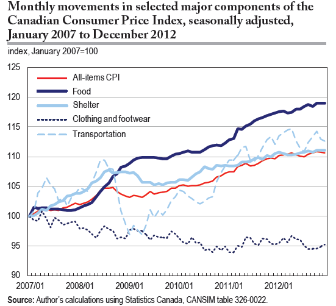

## Learning expectations:

> - Think *big* and *systemic* (this is *public* health nutrition), especially for
possible interventions
> - That food insecurity is **not** really about food
> - What food insecure households experience and struggle with
> - Which came first, poor health or food insecurity? Recognize feedback loop and 
health of food insecure households

## Outline

```{r, echo=FALSE, results='hide', warning=FALSE, message=FALSE}
prodigenr::runSetup('src')
```

- Realities of food insecurity
    - Welfare income vs inflation
    - Budgets for various groups
    - Strategies used
    - Experiences
- Health and food insecurity
    - Food intake and nutrient adequacy
    - Feedback loop, lower health, more food insecure
    - Inuit health
    - Obesity

# Realities of food insecurity: Reflection of the imbalance between resources and expenses

## Welfare income over the decades in Ontario[^welfareTime]

```{r}
read.csv('data/welfareTime.csv') %>% 
    tbl_df() %>% 
    gather(FamilyType, Dollars, -Year) %>% 
    mutate(FamilyType = FamilyType %>% 
               gsub('Single', 'Single ', .) %>% 
               gsub('One', 'One ', .) %>% 
               gsub('Parent', 'Parent ', .) %>% 
               gsub('Four', ' of four', .)) %>% 
    ggplot(aes(Year, Dollars, colour = FamilyType)) +
    geom_line(aes(colour = FamilyType, linetype = FamilyType), size = 1.25) +
    ylab('2013 constant dollars ($)') +
    ggthemes::theme_tufte(base_family = 'Helvetica') +
    theme(legend.title = element_blank())
```

[^welfareTime]: [Welfare in Canada 2013, Caledon Institute of Social Policy](http://www.caledoninst.org/Publications/Detail/?ID=1057)

## Cost of things (inflation)[^costLit]

\centering


[^costLit]: A-M Rollin, Statistics Canada, Economic Insights, no. 027, June 2013.

## Monthly budget for family of 4 (2 adults, boy 14yr, girl 8yr) on welfare (‘Ontario Works’) in Hamilton[^hamRep]: 

```{r, results='asis'}
budget <- read.csv('data/budget.csv')
budgetTable('Family of 4')
```

Income remaining: **`r budgetRemaining('Family of 4')`**

[^hamRep]: From the City of Hamilton, Medical Officer of Health. Report to the
Board of Health, Oct 21, 2013.

## Monthly budget for one-parent family (boy 14yr, girl 8yr) on welfare (‘Ontario Works’) in Hamilton[^hamRep]: 

```{r, results='asis'}
budgetTable('One-parent 2 kids')
```

Income remaining: **`r budgetRemaining('One-parent 2 kids')`**

## Monthly budget for one man (31-50 yr) on welfare (‘Ontario Works’) in Hamilton[^hamRep]: 

```{r, results='asis'}
budgetTable('One male (31-50y)')
```

Income remaining: **`r budgetRemaining('One male (31-50y)')`**

## Monthly budget for one man (31-50 yr) on Ontario Disability Support Program in Hamilton[^hamRep]: 

```{r, results='asis'}
budgetTable('One male: disability')
```

Income remaining: **`r budgetRemaining('One male: disability')`**

## Monthly budget for one man (70+ yr) on Old Age Security/Guaranteed Income Supplement[^hamRep]: 

```{r, results='asis'}
budgetTable('One male (70+y)')
```

Income remaining: **`r budgetRemaining('One male (70+y)')`**

## When working is not enough: food insecurity in the Canadian labour force[^workLit]  

Compared to workers in food-secure households, primary earners in food-insecure
households were more likely to:

. . .

- Report multiple jobs 
- Report higher job stress
- Have not completed high school
- Be visible minorities

<!--Workers living in Quebec had almost 60% lower odds of being food insecure
compared to those in Ontario. Why? -->

[^workLit]: McIntyre et al, Public Health Nutrition 2012.

## Budgeting in the context of limited resources[^budgetFI]:

<!-- 

. . .

- Rent was prioritized over everything else.
- Bills were paid only enough to avoid losing services.
- Participants stretched their food dollars via:
    - Thrifty shopping (using lists, coupons, sales, etc)
    - Cooking with less.
    
. . .

As food insecurity intensified, price became the sole consideration in food purchases. 

-->

[^budgetFI]: Dachner et al, Can J Diet Pract Res. 2010; 71(3)

## Strategies families used in the past 12 months, when facing food shortages:

```{r}
read.csv('data/strategies.csv') %>%
    tbl_df() %>%
    gather(FoodSecure, Proportion,-Strategy) %>%
    ggplot(aes(FoodSecure, Proportion)) +
    geom_bar(aes(fill = FoodSecure), stat = 'identity', colour = 'grey40') +
    geom_text(aes(label = Proportion), vjust = 0) +
    facet_wrap( ~ Strategy, ncol = 3) +
    coord_cartesian(ylim = c(0, 100)) +
    ylab('Proportion (%)') +
    scale_fill_brewer() +
    bar_theme()
```

## Food is not the only problem facing food-insecure households.

Food insecure households face multiple challenges:

- Inadequate and insecure housing
- Compromises in spending on other necessities:
    - Prescription medications
    - Telephone
    - Transportation
    - Clothing
- Debt
- Stress
- Marginalization
- Social isolation

## Experiences of food insecurity in Quebec[^quebecFI]

Quebec adults’ accounts of their experiences of food insecurity:

- Profound lack of food choice
- Monotony of diet disruptions to familial dining patterns
- Need to engage in highly stigmatized means of food acquisition
- Strong feelings of powerlessness, inequity, frustration, alienation

[^quebecFI]: Hamelin et al., Soc Sci & Medicine, 2002

# Food insecurity and food intake

## Dietary intakes of Canadians living in food insecure households[^dietLit]:

Little evidence of dietary inadequacies among young children in Canada, and few
differences in relation to household food security status.

<!-- limitations here? -->

Adults and adolescents in moderately or severely food insecure households had:

- Poorer quality diets (i.e., fewer servings of milk products, fruits and
vegetables, and for some groups, meat and alternatives)
- Higher risk of inadequate intakes for protein, vitamin A, folate, magnesium,
phosphorus, zinc, iron (women), vitamin B6 (adults), vitamin B12 (adults)

[^dietLit]: Kirkpatrick & Tarasuk, J Nutr 2008; 138: 604-612; Danyliw et al,
Public Health Nutrition 2011; 14: 1961-69; Mark et al, Can J Public Health 2012;
103(2): 94-99

```{r}
food <- read.csv('data/foodGroupIntake.csv') %>% 
    gather(Variable, Value, -FoodGroup, -FoodSecure) %>% 
    tbl_df() %>% 
    mutate(Variable = Variable %>% 
               gsub('^F_', 'Female.', .) %>% 
               gsub('^M_', 'Male.', .) %>% 
               gsub('_', '-', .),
           FoodSecure = gsub('Food ', '', FoodSecure) %>% 
               gsub('^(\\D)', '\\U\\1', ., perl = TRUE)) %>% 
    separate(Variable, into = c('Sex', 'Years'), sep = '\\.') %>% 
    na.omit()
```

## Adults' fruit and vegetable consumption by food security status

<!-- go over the next 5 slides, look at the figures, and then we'll talk more -->

```{r}
foodGroupsPlot(food, 'Fruits and vegetables', c(0, 7), '# of servings')
```

## Adults' milk & milk product consumption by food security status

```{r}
foodGroupsPlot(food, 'Milk products', c(0, 2.3), '# of servings')
```

## Adults' grain product consumption by food security status

```{r}
foodGroupsPlot(food, 'Grain products', c(0, 9), '# of servings')
```

## Adults' meat and alternative consumption by food security status

```{r}
foodGroupsPlot(food, 'Meat and alternatives', c(0, 7), '# of servings')
```


## Analysis of beverage intake patterns among Canadian children and adolescents[^beverages]

```{r, fig.height=6.5}
read.csv('data/beverageKids.csv') %>% 
    gather(Sex, Proportion, -Drink) %>% 
    ggplot(aes(Sex, Proportion)) +
    geom_bar(aes(fill = Sex), stat = 'identity', colour = 'grey40') +
    geom_text(aes(label = Proportion), vjust = 0) +
    coord_cartesian(ylim = c(0, 15)) +
    facet_grid(~Drink) +
    ylab('Proportion of food insecurity (%)') +
    scale_fill_brewer() +
    bar_theme()
```

[^beverages]: Danyliw et al, Public Health Nutrition 2011; 14: 1961-69.

## Prevalence of inadequate protein intake (g/kg/day)[^nutrientLit]

```{r}
foodGroupsPlot(food, 'Inadequate protein (%)', c(0, 70), 'Prevalence of inadequate intake (%)')
```

<!--
Estimated usual intakes were compared to requirements expressed as g/kg/day,
including only participants with measured heights.

**Note: Prevalence < 10% for males 19-30 yr in food secure households.**
-->

[^nutrientLit]: Kirkpatrick & Tarasuk, J Nutr, 2008: 138: 604-612

## Mean total fat intake (g/day)[^nutrientLit]

```{r}
foodGroupsPlot(food, 'Mean fat intake (g/day)', c(0, 130), 'Fat intake (g/day)')
```

<!-- What is a problem with this measure? What is it really telling us? Getting
too low may be a problem, as our bodies operate best with a fair amount of fat
intake. -->

## Mean sodium intake (mg/day)[^nutrientLit]

```{r}
foodGroupsPlot(food, 'Mean sodium intake (mg/day)', c(0, 4700), 'Sodium intake (mg/day)')
```

## Nutrient adequacy in adults[^nutrientLit]

Higher prevalence of inadequacy among food-insecure subgroups for:

- Protein
- Magnesium
- Vitamin A
- Zinc
- Vitamin B6
- Iron (women)
- Vitamin B12
- Folate

Inadequacy > 10% for thiamin, riboflavin, and phosphorus, only among
food-insecure subgroups.

No inadequacy for niacin, irrespective of food security status.

## Nutrient adequacy in children[^nutrientLit]

<!-- 

. . .

No prevalence of nutrient inadequacy > 10% for children 1-3 yr and 4-8 yr,
irrespective of household food security status.
	
Substantial levels of inadequacy among those 9-13 yr and 14-18 yr for:

- Protein
- Vitamin A
- Magnesium
- Phosphorous
- Zinc
- Folate (females)

Prevalences were typically higher among food-insecure subgroups
-->

# Intimate relationship between food insecurity and health (and vice versa)

## A complicated relationship...[^foodHealth]
	
```{r}
grViz("
digraph {
    # add nodes
    graph [overlap = true, rankdir = 'LR']
    node [shape = box, fontname = 'TeX Gyre Adventor']
    ph [label = 'Poor health']
    fi [label = 'Food insecure']
    diet [label = 'Diet quality']
    strat [label = 'Strategies']
    wgt [label = 'Wgt gain/loss']
    gly [label = 'Blood glucose']

    # add edges
    fi -> {diet strat}
    strat -> {wgt gly}
    diet -> {wgt gly}
    wgt -> ph
    gly -> ph
}")
```

\centering
\includegraphics[width=\textwidth]{img/foodToHealth.png}

<!-- strategies = compensatory strat, stress+lower capacity to manage health,
strat = not waste food, skip meals, overconsume, reduce cal intake, ph =
obesity, DM, hypertension -->

[^foodHealth]: Parker et al, Ann Epidemiol 2010; Seligman et al, J Gen Intern
Med 2007; Seligman and Schillinger, N Engl J Med 2010; Whitaker et al,
Pediatrics 2006; Seligman & Schillinger, NEJM 2010

## ...or the other way around?[^foodHealth]

```{r}
grViz("
digraph {
    # add nodes
    graph [overlap = true, rankdir = 'LR']
    node [shape = box, fontname = 'TeX Gyre Adventor']
    ph [label = 'Poor health']
    s [label = 'Stress/anxiety']
    hcc [label = 'Healthcare']
    fi [label = 'Food insecure']
    mh [label = 'Mental health']
    save [label = 'Finances']

    # add edges
    ph -> {s hcc mh save}
    mh -> {s save}
    s -> save
    hcc -> save
    save -> fi
}")
```

\centering
\includegraphics[width=\textwidth]{img/healthToFood.png}

## Youth, hunger, and chronic diseases[^chrDisHunger]

Analyses of National Longitudinal Survey of Children and Youth (10+ years of follow-up):

- Children and youth who experienced hunger (ever) were more likely to have
poorer health.
- Child hunger predicted depression and suicidal ideation in late adolescence
and early adulthood.
- Multiple episodes of hunger were associated with higher odds of chronic
conditions, including asthma.

[^chrDisHunger]: Kirkpatrick et al., Archives of Pediatric and Adolescent
Medicine 2010; McIntyre et al., Journal of Affective Disorders 2013.

## Cross-sectional associations between household food insecurity and adults’ health[^healthFI]

Independent of other social determinants of health, adults with some indication
of household food insecurity have higher odds of

- Poor self-rated health
- Poor mental, physical, and oral health
- Multiple chronic conditions, e.g., diabetes, heart disease, hypertension,
depression, fibromyalgia

[^healthFI]: Che & Chen, Health Rep 2001; Fuller-Thompson et al, Rheumatol Int
2011; Gucciardi et al, Diabetes Care 2009; Muirhead et al, Community Dent Oral 
Epidemiol 2009; Vozoris & Tarasuk, J Nutr 2003; Willows et al, Health Reports, 
2011

## Relationship between adult’s disease status[^conditions] and the presence and severity of household food insecurity?[^chrDis]

Analysis of CCHS 2007-08:

- n=77,053 adults
- 18–64 years

Key findings:

<!--
. . .

> - Independent of other socio-demographic correlates of household food
insecurity, a strong dose-response relationship between adult’s number of
chronic conditions and odds of household food insecurity.
> - Higher odds of food insecurity and more severe food insecurity among adults
with most conditions assessed.
> - The pairing of a mood or anxiety disorder with any other condition heightened
risk.

-->

[^conditions]: Conditions include asthma, arthritis, back and bowel problems, diabetes,
heart disease, hypertension, migraines, mood/anxiety disorder, ulcers

[^chrDis]: Tarasuk et al, Journal of Nutrition, 2013

## Prevalence of chronic conditions among adults by household food security status[^chrDis]

```{r, fig.height=6.75}
chrDis <- read.csv('data/chronicConditions.csv')
chrDis %>% 
    gather(Variable, Value, -NumConditions) %>% 
    mutate(NumConditions = NumConditions %>% 
               factor(., levels = unique(.)),
           Variable = Variable %>% 
               gsub('\\.food\\.insecure', '', .) %>% 
               gsub('Food\\.secure', 'Secure', .) %>% 
               factor(., levels = unique(.))) %>% 
    ggplot(aes(Variable, Value)) +
    geom_bar(aes(fill = Variable), stat = 'identity', colour = 'grey40') +
    geom_text(aes(label = Value), vjust = 0) +
    coord_cartesian(ylim = c(0, 55)) +
    facet_grid(. ~ NumConditions) +
    ylab('Proportion (%)') +
    scale_fill_brewer() +
    bar_theme()
```

## Proportion of Canadian adults (18 - 64 years) reporting selected chronic conditions[^chrDis]

```{r, fig.height=6.75}
chrDis_sex <- read.csv('data/chronicConditions_Sex.csv')
chrDis_sex %>% 
    gather(Variable, Value, -Sex, -ChronicCondition) %>% 
    mutate(Variable = Variable %>% 
               gsub('\\.insecurity', '', .) %>% 
               gsub('food\\.secure', 'Secure', .) %>% 
               factor(., levels = unique(.))) %>% 
    ggplot(aes(Variable, Value)) +
    geom_bar(aes(fill = Variable), stat = 'identity', colour = 'grey40') +
    geom_text(aes(label = Value), vjust = 0) +
    coord_cartesian(ylim = c(0, 55)) +
    facet_grid(Sex ~ ChronicCondition) +
    ylab('Proportion (%)') +
    scale_fill_brewer() +
    bar_theme()
```

<!-- Take a second to look this over. Then I want to hear your thoughts on it. I
don't know this area enough, but does anyone have any ideas on why the
differences? -->

## Prevalence of food insecurity is high and the diet quality poor in Inuit communities[^inuit]

<!-- so we had a look at canadians in general, but what about the high groups?
Like the Inuit? -->

[^inuit]: Huet, Rosol & Egeland, J Nutr 2012.

Inuit Health Survey: 1901 Inuit households, 2007-08

- 33.6% moderately food insecure.
- 29.1% severely food insecure.

. . .

<!-- what would be some problems that food insecure Inuit households face? How
would they be different from food secure households in Nunavut?-->

> - Food insecurity was associated with household crowding, income assistance,
public housing, single adult household, home in need of major repair, and having
**no active hunter** in the home.
> - Adults from food insecure households had a significantly lower Healthy Eating
Index score; consumed fewer vegetables and fruit, grains, and dairy products;
and consumed a greater percent of energy from high-sugar foods.

<!-- We're jumping a head here on the health and food intake, but...-->
<!-- besides the comment here re: fruit+veg+grain+milk. Is this really a
surprise finding? Even considering food insecurity? -->

<!-- we have no solid evidence on what constitutes a healthy diet in this
population... and yet we are making recommendations/inferring here that lower of
what we consider healthy eating is bad for the Inuit people -->

<!-- what else could fruit+veg consumption be a picking up (SES)-->

## Food insecurity and nutritional biomarkers in relation to stature in Inuit children from Nunavik[^inuit2] 

[^inuit2]: Pirkle et al, CJPH 2014.
 
Survey of 294 school-aged children drawn from 2 birth cohorts:

- Food insecurity assessed with 3 questions (enough to eat; adults/children cut size of meals)
- Nutritional biomarkers measured

Results:

> - 49.7% classed as food insecure.
> - Prevalence of iron depletion: 33%
    - Food insecure children marginally more likely to be anemic and had
    lower hemoglobin levels.
> - Prevalence of short stature: 18.7%
    - Food insecure children on average 2 cm shorter than food secure (p<0.01)
    
<!-- what would you expect would happen to their stature? -->

## Potential mechanisms by which chronic illness can heighten risk of food insecurity[^chrDis]:

<!-- we've already talked a lot about this, but what are some mechanisms? -->

. . .

- Chronic disease can diminish adults’ earning power, but findings persist
after accounting for household income, income source, home ownership.
- Adult’s chronic ill-health may pose additional demands on household’s financial
resources.
- Adults’ ill-health may constrain their ability to cope in situations of scarce
financial resources.

# Food insecurity and obesity

## Obesity rates between food secure and insecure[^obese]

```{r}
read.csv('data/bmi.csv') %>% 
    mutate(Measured = Measured %>% factor(., levels = unique(.))) %>% 
    ggplot(aes(FoodSecure, Percent)) +
    geom_bar(aes(fill = FoodSecure), stat = 'identity', colour = 'grey40') +
    geom_text(aes(label = Percent), vjust = 0) +
    coord_cartesian(ylim = c(0, 33)) +
    facet_grid(Measured ~ Sex) +
    ylab('Prevalence of obesity (%)') +
    scale_fill_brewer() +
    bar_theme()
```

[^obese]: Lyons et al, Am J Public Health 2007

## Adjusted odds[^adjObese] of obesity (95%) with household food insecurity[^obese]

|Status| Men |Women|
|:-----|:---:|:---:|
|Food secure|1.0|1.0|
|Insecure without hunger|1.02 (0.55--1.88)|0.95 (0.60--1.50)|
|Insecure with mild hunger|1.77 (0.74--4.27)|**2.72 (1.43--5.16)**|
|Insecure with severe hunger|1.18 (0.31--4.48)|2.04 (0.74--5.59)|

Note: including adults with measured height and weight

[^adjObese]: Adjusted for age, household income, education, ethnicity, marital
status, and place of residence.

<!--
Household income, food insecurity and nutrition
in Canadian youth.  
Mark et al, Can J Public Health 2012; 103(2): 94-99. 

Among youth in low-income households, food insecurity was associated with 

BMI > 85th percentile in boys, but not girls.
Greater consumption of sweetened beverages and lower consumption of milk products among girls.

Food insecurity was not associated with calcium, fibre, saturated fat, or
energy, energy intake/estimated energy expenditure.
-->

<!--maybe this slide??-->
## Obesity association most consistently seen for adult women---not men or children

Some limitations of existing research: 

- Cross-sectional
- Food insecurity measured for last 12 months---what is relevant period of
exposure?
- Self-reported height and weight data
- Confounding by parity, chronic physical or mental health problems, family
structure, etc.

<!-- what could be some potential confounders? -->

## Are changes in women’s food security status associated with changes in their body weight?[^femaleWgt]

**Design:**

- 2 yr follow-up of 1707 mothers of preschool children
- Measured height and weight
- Food security status assessed with HFSSM.

**Results:**

- Changes in food security status over 2 yr were not significantly associated
with changes in weight.
- No evidence of a causal association between food insecurity and obesity.

[^femaleWgt]: Whitaker & Sarin, J Nutr 2007; 137: 2134-2139.

## Confronting myths about household food insecurity and excess body weight[^mythsWgt]

<!-- 

. . .

Food insecurity is a measure of material deprivation, but not necessarily
manifested as **starvation**.

Hunger and malnutrition (i.e., undernutrition and obesity) are potential, but 
not necessary, consequences of household food insecurity.

- Severe food insecurity: weight deficit
- In some contexts, moderate food insecurity weight excess.
- Material deprivation leads to bad outcomes across multiple domains; that one of
these should be excess weight is not a ‘paradox’.

-->

[^mythsWgt]: EA Frongillo, Cad Saude Publica, 2013.

## For next week, please read:

Loopstra R, Tarasuk V. The relationship between food banks and household food
insecurity among low-income Toronto families. Canadian Public Policy 38.4
(2012): 497-514.

Tarasuk V. Donating ‘edible waste’ to food banks in exchange for tax credit? Now
that’s a rubbish idea. The Globe and Mail. Published Nov. 02, 2015.
http://www.theglobeandmail.com/globe-debate/donating-edible-waste-to-food-banks-in-exchange-for-tax-credit-now-thats-a-rubbish-idea/article27064689/

Graham Riches and Valerie Tarasuk . (September 2014). Canada: Thirty Years of
Food Charity and Public Policy Neglect. In First World Hunger Revisited, 2nd
edition. (pp.42–56). Retrieved from
http://www.palgraveconnect.com.myaccess.library.utoronto.ca/pc/doifinder/10.1057/9781137298737.0009

